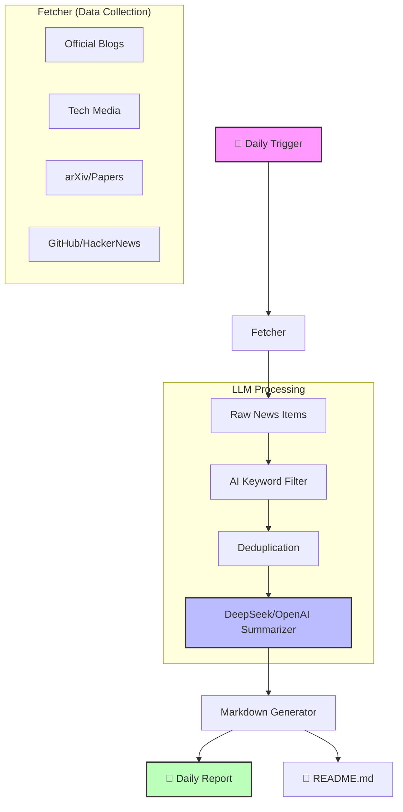

# AI 资讯日报

> 自动追踪全球 AI 领域最新动态，每日更新。
> 内容涵盖：新模型、Agent、编程能力、开源项目等。

## 📅 日报列表

- [2026-03-03](daily/2026-03-03.md)
- [2026-03-02](daily/2026-03-02.md)
- [2026-03-01](daily/2026-03-01.md)
- [2026-02-28](daily/2026-02-28.md)
- [2026-02-27](daily/2026-02-27.md)
- [2026-02-26](daily/2026-02-26.md)

## 🌐 资讯来源

本项目聚合了全球最权威的 AI 媒体、实验室博客和技术社区，力求提供最全最新的 AI 资讯：

### 🗞️ 综合科技 + AI（核心）
- **[MIT Technology Review](https://www.technologyreview.com/)**: 深度科技报道与分析
- **[VentureBeat AI](https://venturebeat.com/category/ai/)**: 企业级 AI 应用与趋势
- **[TechCrunch AI](https://techcrunch.com/category/artificial-intelligence/)**: 创业公司与投融资动态
- **[The Information](https://www.theinformation.com/)**: 独家深度科技新闻（部分内容）
- **[Ars Technica AI](https://arstechnica.com/ai/)**: 深度技术评论
- **[The Verge AI](https://www.theverge.com/ai-artificial-intelligence)**: 消费级 AI 产品新闻

### 🏛️ AI 官方博客
- **[OpenAI Blog](https://openai.com/blog)**: GPT 系列与 AGI 路线图
- **[Google DeepMind](https://deepmind.google/discover/blog/)**: Gemini, AlphaFold 等基础研究
- **[Anthropic News](https://www.anthropic.com/news)**: Claude 模型安全与更新
- **[Hugging Face Blog](https://huggingface.co/blog)**: 开源模型、数据集与教程
- **[Meta AI Blog](https://ai.meta.com/blog/)**: LLaMA 开源生态
- **[Microsoft Research](https://www.microsoft.com/en-us/research/blog/)**: 计算机科学前沿

### 🔬 AI 研究 / 技术趋势
- **[Hugging Face Daily Papers](https://huggingface.co/papers)**: 每日最热门 AI 论文
- **[arXiv CS.AI](https://arxiv.org/list/cs.AI/recent)**: 人工智能最新预印本
- **[arXiv CS.LG](https://arxiv.org/list/cs.LG/recent)**: 机器学习最新预印本
- **[arXiv CS.CL](https://arxiv.org/list/cs.CL/recent)**: 计算语言学最新预印本

### 💡 高质量聚合 / 社区
- **[Hacker News](https://news.ycombinator.com/)**: 极客视角的 AI 技术讨论
- **[Techmeme](https://www.techmeme.com/)**: 科技新闻聚合（必读）
- **[GitHub Trending](https://github.com/trending)**: 热门开源项目
- **[Reddit r/MachineLearning](https://www.reddit.com/r/MachineLearning/)**: 严肃学术讨论
- **[Reddit r/LocalLLaMA](https://www.reddit.com/r/LocalLLaMA/)**: 本地大模型实战

## 🛠️ 实现原理

本项目基于 Go 语言开发，利用 GitHub Actions 实现全自动运行。



## 🚀 配置说明

如果你想自己部署，请参考以下配置：

### 环境变量（可选）

```bash
# Product Hunt API Key（可选，获取产品资讯）
export PRODUCTHUNT_API_KEY=your_key

# LLM 配置（可选，用于生成中文摘要）
# 支持 OpenAI, DeepSeek, Moonshot 等兼容接口
export LLM_API_KEY=sk-xxxxxx
export LLM_BASE_URL=https://api.deepseek.com/v1  # 默认为 OpenAI
export LLM_MODEL=deepseek-chat                   # 默认为 gpt-3.5-turbo
```
